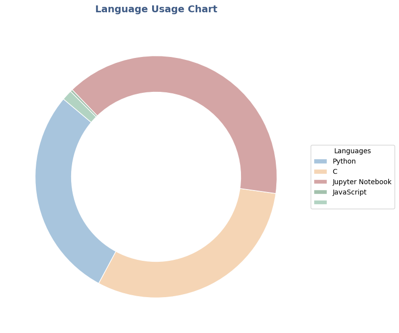

# Language Usage

Last updated: 2024-11-08 16:23:37 UTC

- Python: 50.3%
- C: 1.09%
- JavaScript: 0.14%
- CSS: 0.02%
- Makefile: 0.01%
- Shell: 8.14%
- C++: 4.65%
- Solidity: 0.03%
- Jupyter Notebook: 28.5%
- Cuda: 7.02%
- CMake: 0.03%
- HTML: 0.03%
- Dockerfile: 0.05%
- Jsonnet: 0.0%

